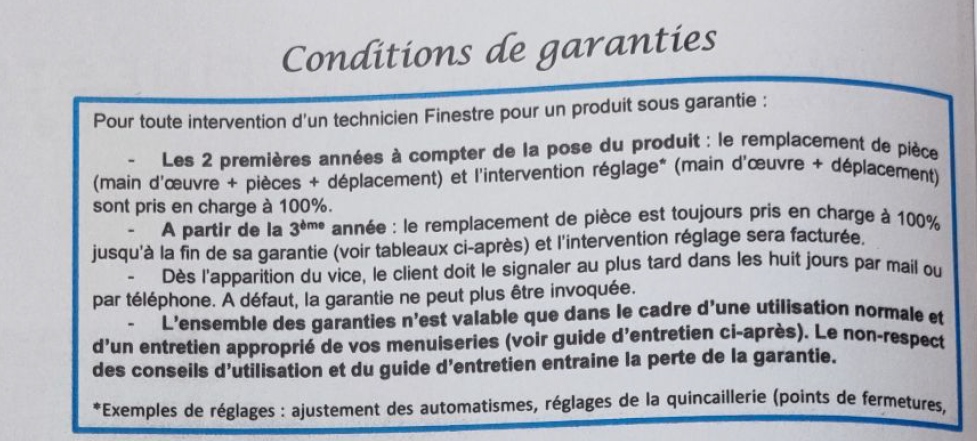

Je vous contacte en votre qualité de responsable légal de la société SARL Sud Menuiserie PVC - FINESTRE inscrit au RCS Montpellier 420 690 760 000 20, l'émetteur de la facture No 41/09 acquittée en date du 22/09/2021.

L'installation est intervenue le 23-24 Septembre 2021 selon PV.

Quatre mois après l'installation, le dysfonctionnement initial de la télécommande est rapporté avec demande d'intervention.

Cette panne qui n'a jamais été réparée est au bénéfice de la garantie biennale couvrant pièce et main-d'oeuvre et déplacement et réglage avec une prise en charge à 100%.

{width="400"}

Pour ces motifs, je mets en demeure votre société d'exécuter les travaux dans un délai de 15 jours ou au plus tard le 7 août 2026.

Par la même, dans le respect des conditions contractuelles précitées, je vous laisse répondre sous ce délai par l'acceptation d'un réglement amiable et par l'achèvement de la réparation à vos frais.
